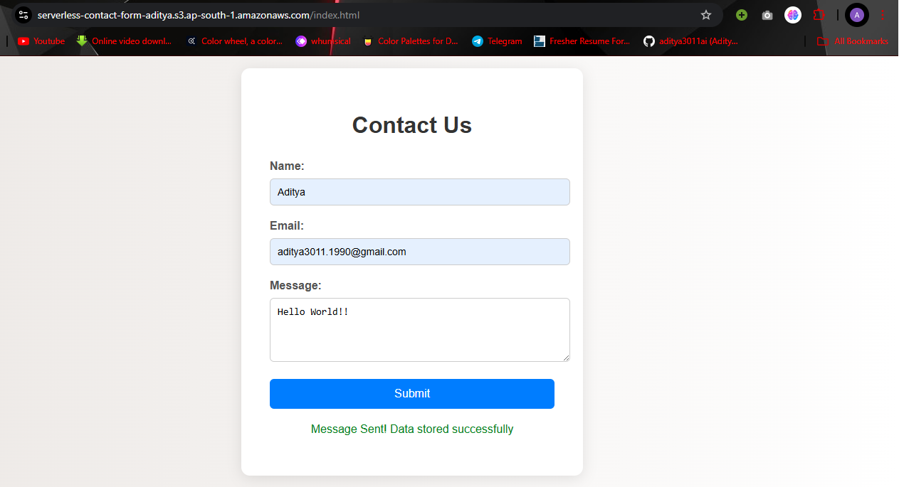

# Serverless Contact Form using AWS

Link - http://serverless-fronted-aditya3011ai.s3-website.ap-south-1.amazonaws.com

A simple contact form built using AWS Serverless services.



## 🚀 Features

- 📩 Submits contact form data via a REST API (API Gateway)
- 🧠 Serverless backend logic (AWS Lambda)
- 🗃️ Stores user data in DynamoDB
- 📧 Sends email notifications using AWS SNS
- 🌐 Frontend hosted on AWS S3 (static website)
- ✅ Built with AWS Free Tier — no cost for personal/demo use
- 🔒 CORS enabled for browser-based submissions

---

## 🛠️ Technologies & AWS Services

- **AWS Lambda** – Runs backend code serverlessly
- **API Gateway** – Exposes HTTP endpoint
- **DynamoDB** – Stores form data (name, email, message)
- **SNS** – Sends email notifications
- **S3** – Hosts static frontend (HTML/CSS/JS)

---

## 📂 Folder Structure

📁 serverless-contact-form/
├── lambda/
│ └── index.js # Main Lambda function code
├── frontend/
│ ├── index.html # Contact form frontend
│ └── script.js # JS to call API
├── README.md
└── template.yaml # (Optional) SAM or CloudFormation template

---

## 🧪 API Endpoint

POST /submit


### Request Body (JSON):
```
json
{
  "name": "John Doe",
  "email": "john@example.com",
  "message": "Hello! I'm interested in your services."
}
Response:
json
{
  "message": "Data stored successfully"
}
```